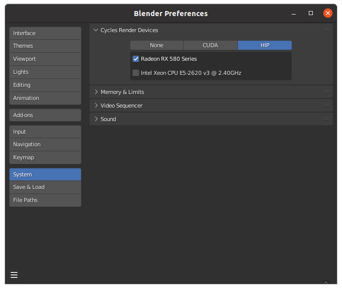
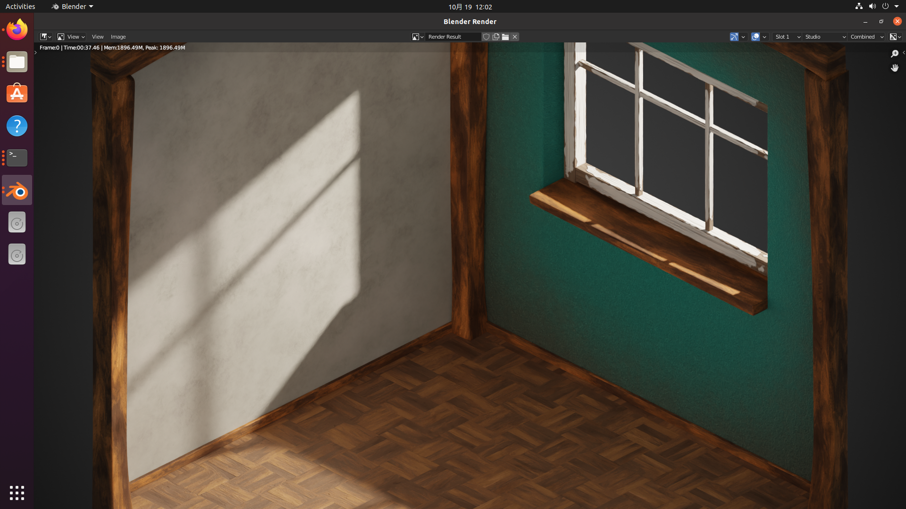

# ROCm with gfx803 on blender3

Finally, I can use cycles renderer of blender3 on the gfx803.

But I cannot find the reason of problem, I just changed all of `__noinline__` to `__inline__`, and compile cycles for gfx803.

At the same time, ROCm-5.2.3 always report a mem fault error, then ROCm-5.3 released, everything is ok.

I am afraid the next version of ROCm may cause cycles break again, but right now, it can run successfully.

|OS            |linux|Python|ROCm |GPU  |Blender|
|--------------|-----|------|-----|-----|-------|
|Ubuntu-20.04.5|5.15 |3.8.10|5.3.0|RX580|3.3.1  |

Install ROCm First <https://docs.amd.com/bundle/ROCm-Installation-Guide-v5.3/page/Introduction_to_ROCm_Installation_Guide_for_Linux.html>

|component     |version   |size   |link|
|--------------|----------|-------|----|
|rocr-runtime  |1.7.0     |902K   |https://github.com/xuhuisheng/rocm-gfx803/releases/download/rocm530/hsa-rocr_1.7.0.50300-63.20.04_amd64.deb|
|blender-gfx803|3.3.1     |300M   |https://github.com/xuhuisheng/rocm-gfx803/releases/download/rocm530/blender331-gfx803.7z|

1. Install ROCm-5.3.0
2. `sudo dpkg -i hsa-rocr_1.7.0.50300-63.20.04_amd64.deb`
3. `7z x blender331-gfx803.7z`

The `kernel_gfx803.fatbin` is on the `blender331-gfx803/3.3/scripts/addons/cycles/lib/`.

---

My modification is very simple.

1. modify `intern/cycles/device/hip/compat.h`, change all of `__noinline__` to `__inline__`
2. modify `intern/cycles/device/hip/util.h`, change `9` to `8`, then cycles can use gfx803.

---

I test [cube_diorama](https://www.blender.org/download/demo/bundles/bundles-3.0/asset-demo-bundle-3.0-cube-diorama.zip) successfully.

But I cannot guaruntee we won't meet other problems. You could have a try with your own risk.

My suggestion is just buy a ROCm offically supported card, like Vega64, RadeonVII, RDNA.

